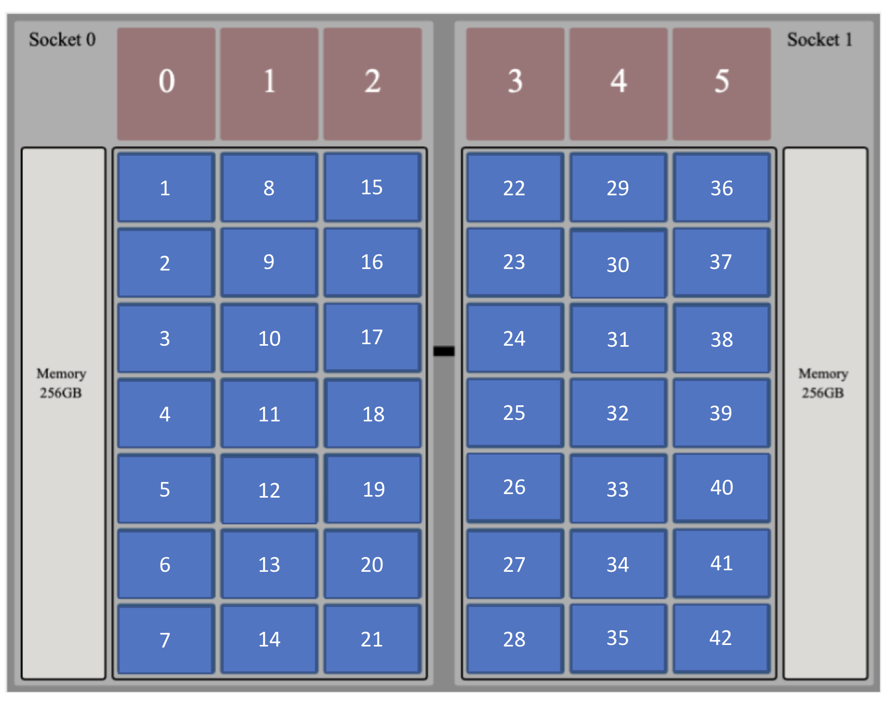

[Main](../index)

Node Layout
===========
Node Layout is a unique feature of Cheetah that allows users to obtain fine-grained process placement on to supported machines.
It allows pinning MPI ranks to specified cores and GPUs of a target system.
On some machines such as the Titan supercomputer at ORNL, it was a simple ranks-per-node, whereas on some machines such as Summit, more complex mapping can be achieved.
This mapping can be obtained by setting the node layout property in a Sweep object.

For machines with complex process mapping support, the Node Layout is an object describing a compute node of the system.
For the Summit supercomputer, the SummitNode() object represents a compute node.

SummitNode
----------

Due to the highly heterogeneous architecture of the Summit supercomputer and the associated `jsrun` utility to run jobs, running Cheetah on Summit mandates using the `node-layout` property of a Sweep where users have to map processes to resources on a node. 

A detailed description of the architecture of Summit can be found at the [ORNL Summit User Guide](https://docs.olcf.ornl.gov/systems/summit_user_guide.html).

{:height="350px"}

jsrun allows sharing a compute node between multiple applications; however, orchestrating such a workflow can be difficult.
Thus, we present the SummitNode object that allows users to explicitly map application ranks to resources.

The SummitNode object describes the architecture of a compute node of Summit.
It must be used to specify the process distribution onto the compute nodes on Summit.
Every application in the workflow must be specified on a SummitNode.
As Summit allows placing ranks from different applications on to the same compute node, two node configurations are possible: 1) applications share compute nodes, 2) applications reside on separate nodes.

To place application ranks on separate nodes, create a SummitNode object for each application.
The snippet below shows how to map ranks to resources of a SummitNode.
The format is `node.resource[index] = 'app_handle:rank_id'`, where resource can either be `'cpu'` or `'gpu'`.
Note that multiple CPUs can be mapped to a single rank, whereas multiple GPUs can be mapped to multiple ranks.
That is, a CPU core can only be mapped to a single application rank, whereas a GPU can be mapped to multiple ranks from multiple applications.
If a rank if mapped to multiple cores, the cores must be consecutive in order.

Separate Nodes for separate applications
----------------------------------------

The snippet below maps ranks from different applications on to separate compute nodes.


``` python
sim_node = SummitNode()

# Use 40 cores of the node
for i in range(40):
    sim_node.cpu[i] = 'simulation:{}'.format(i)

# On a separate node object, spawn one rank of the analysis
analysis_node = SummitNode()
analysis_node.cpu[0] = 'analysis:0'
analysis_node.gpu[0] = 'analysis:0'

# Create the node layout with the two separate node objects
node_layout = [sim_node, analysis_node]
```

Cheetah utilizes this node layout and calculates the total number of nodes required depending on the `nprocs` property for the applications.

Node Sharing
------------

To create a shared node layout where MPI ranks from multiple applications share a node, place multiple applications on the same SummitNode object.

``` python
shared_node = SummitNode()

# Simulation ranks
for i in range(8):
    shared_node.cpu[i] = 'S:'.format(i)
for i in range(8):
    shared_node.cpu[21+i] = 'S:'.format(8+i)

# Analysis ranks
for i in range(4):
    shared_node.cpu[8+i] = 'A:'.format(i)
for i in range(4):
    shared_node.cpu[21+8+i] = 'A:'.format(4+i)

# Create a node layout with the same shared node object
node_layout = [shared_node]
```

The above snippet generates the following mapping on the compute node.

{:height="350px"}


Cheetah utilizes the node layout and calculates the total number of nodes required depending on the `nprocs` property for the applications.

Examples using the Node Layout for Summit can be seen here: [02](https://github.com/CODARcode/cheetah/blob/dev/examples/02-coupling/cheetah-campaign.py), [03](https://github.com/CODARcode/cheetah/blob/dev/examples/03-brusselator/cheetah-campaign.py), [04](https://github.com/CODARcode/cheetah/blob/dev/examples/04-gray-scott/cheetah-summit.py). 

[Main](../index)

